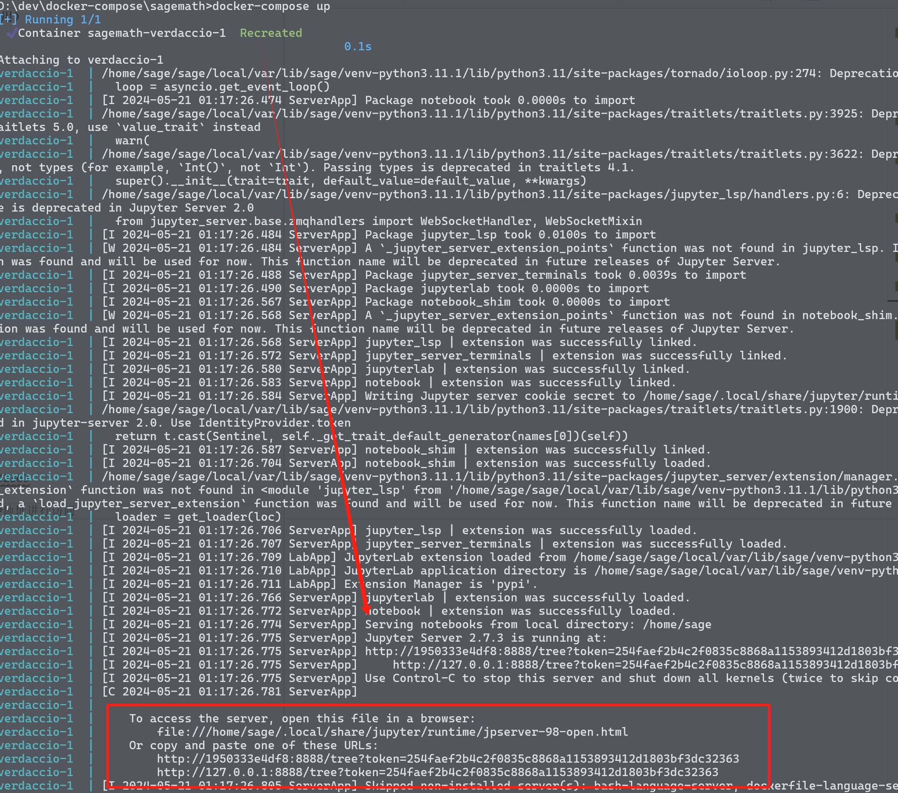
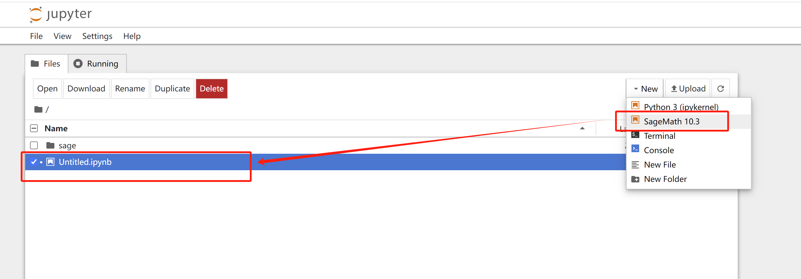
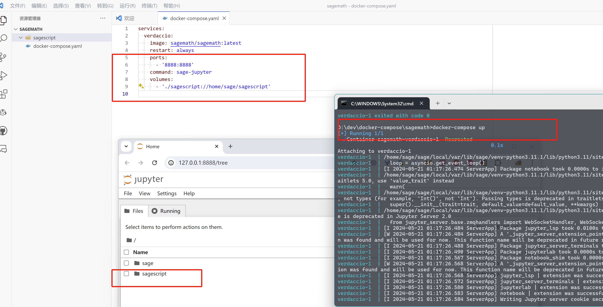

# 使用docker运行SageMath服务，简单介绍通过浏览器和VSCode运行脚本（推荐个人或教学使用）

## 前置学习条件：

* 会基础的 docker 安装使用
* 会 VSCode 安装使用

## 下载镜像并且运行

访问sagemath 镜像主页：

https://hub.docker.com/r/sagemath/sagemath

### 运行方式一

```
docker run -p8888:8888 sagemath/sagemath:latest sage-jupyter
```

运行取来服务后在命令行控制台（终端）找到启动日志中类似于：

http://127.0.0.1:8888/tree?token=254faef2b4c2f0835c8868a1153893412d1803bf3dc32363



的地址在浏览器中打开，就可以通过浏览器运行sage脚本了，如果是远程服务器修改服务器的IP地址进行访问




### 运行方式二（推荐）

要求会些 docker-compose 用法

同时将`sagescript`文件中脚本夹挂载到容器中

```
docker-compose up
```

docker-compose.yaml 配置文件
```
services:
  sagemath:
    image: sagemath/sagemath:latest
    restart: always
    ports:
      - '8888:8888'
    command: sage-jupyter
    volumes:
      - './sagescript:/home/sage/sagescript'

```

注意图中的目录结构



在VSCode中，编辑窗口右上角选择配置运行的jupyter服务器


填入jupyter服务器的地址


## 加入学习群

国内使用SageMath的人比较少，近些年大学开设了密码科学与技术和信息安全专业学习的人才有了一些，如果有交流学习的可以扫码加入或者加我微信: discrete_log ,备注来源: sage


